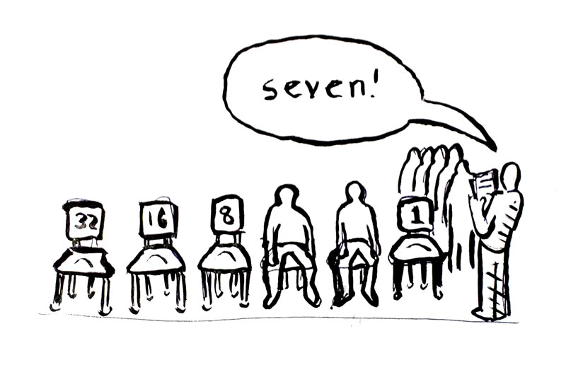

Binary Counting Bureau (BCB)
============================

A bureacratic game for learning to count in binary.

Meta-instructions
-----------------

You will need a black & white printer in order to assemble materials for this game, or ideally a color printer that can print to #10 envelopes.

1. Print out `instructions.pdf`, `numbers.pdf` and `timesheet.pdf` on 8.5" x 11" sheets of paper.
2. Fill in the blank spaces in the printed version of `instructions.pdf`.
2. (optional) Print `envelope.pdf` to an empty #10 envelope.
3. Stack the 8.5" x 11" sheets with the instructions on top.
4. Fold the stack and place it in the envelope.
5. Find a volunteer to start the game.
6. Hand your volunteer the envelope. That person is now in charge.